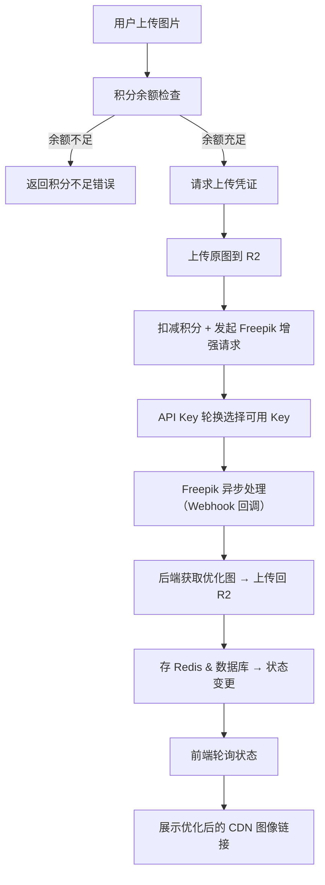

📘 图像增强 SaaS 项目完整流程文档（含 Freepik API Key 轮换机制）

## 🏗️ 现有系统架构总结

### 数据库架构 (Supabase)
| 表名 | 用途 | 关键字段 |
|------|------|----------|
| `users` | 用户管理 | `id`, `role`, `stripe_customer_id` |
| `usage` | 积分余额 | `one_time_credits_balance`, `subscription_credits_balance`, `balance_jsonb` |
| `credit_logs` | 积分记录 | `amount`, `type`, `notes`, `user_id` |
| `pricing_plans` | 价格计划 | `benefits_jsonb`（含积分配置） |
| `subscriptions` | 订阅管理 | `status`, `current_period_end`, `plan_id` |
| `orders` | 订单记录 | `order_type`, `amount_total`, `related_order_id` |

### 存储系统 (Cloudflare R2)
- **文件结构**: `users/{userId}/original-xxx.png`, `users/{userId}/optimized-{taskId}.png`
- **访问方式**: CDN 通过 `R2_PUBLIC_URL` 公开访问
- **上传机制**: Presigned URL（10分钟有效期）+ 服务端直传

### 限流系统 (Upstash Redis)
- **限流策略**: 滑动窗口算法，支持多维度限制
- **当前应用**: Newsletter 订阅限制（每日最大提交次数）
- **配置灵活**: 按时间单位（s/m/h/d）和请求次数组合

### 积分管理系统
- **扣减机制**: `deductCredits()` 函数 + `deduct_credits_and_log` 数据库函数
- **授予机制**: Stripe Webhook 触发自动积分授予
- **双重积分**: 一次性积分（购买获得）+ 订阅积分（月度/年度分配）

## 🧱 增强后技术组成
| 模块 | 技术 | 新增特性 |
|------|------|----------|
| 存储 | Cloudflare R2（原图 & 优图） | 复用现有 Presigned URL 机制 |
| 图像增强 | Freepik Magnific API | **API Key 轮换机制** |
| 状态追踪 & 限流 | Upstash Redis | 积分检查 + 任务状态缓存 |
| 用户限制 | 现有积分扣减系统 | 集成现有积分机制 |
| 后端框架 | Next.js API Routes | 复用现有架构 |
| 数据库 | Supabase | 新增任务记录表 + API Key 管理表 |

## 🧭 用户流程概览



## ✅ 步骤详解（集成现有系统）

### ① 积分余额检查
**接口**: `GET /api/user/benefits`（现有）

**返回内容**:
```json
{
  "success": true,
  "data": {
    "totalAvailableCredits": 100,
    "oneTimeCreditsBalance": 50,
    "subscriptionCreditsBalance": 50,
    "activePlanId": "plan_xxx"
  }
}
```

**重点**: 
- 复用现有 `getClientUserBenefits()` 函数
- 前端检查 `totalAvailableCredits >= 图像增强消耗积分`

### ② 获取上传地址 Presigned URL
**接口**: `POST /api/upload/presigned-url`（现有）

**参数**:
```json
{
  "fileName": "image.jpg",
  "contentType": "image/jpeg"
}
```

**返回内容**:
```json
{
  "presignedUrl": "https://r2.presigned.url",
  "publicObjectUrl": "https://cdn.imgenhancer.ai/users/{userId}/original-xxx.png",
  "key": "users/{userId}/original-xxx.png"
}
```

**重点**: 
- 复用现有 `generateUserPresignedUploadUrl()` 函数
- 路径自动包含 `userid-{userId}` 用户隔离

### ③ 上传原图至 R2（前端）
```typescript
await fetch(presignedUrl, {
  method: 'PUT',
  body: file,
  headers: {
    'Content-Type': file.type,
    // 注意：R2 需要设置公开读权限，确保 Freepik 能访问
  }
})
```

### ④ 发起图像增强请求
**接口**: `POST /api/enhance/start`

**参数**:
```json
{
  "r2Key": "users/123/original-xxx.png",
  "scaleFactor": "4x",
  "optimizedFor": "standard",
  "prompt": "optional enhancement prompt",
  "creativity": 0,
  "hdr": 0,
  "resemblance": 0,
  "fractality": 0,
  "engine": "automatic"
}
```

**后端操作流程**:

1. **用户认证与积分检查**
```typescript
// 获取用户信息
const { data: { user } } = await supabase.auth.getUser()

// 检查积分余额
const benefits = await getUserBenefits(user.id)
const requiredCredits = calculateRequiredCredits(scaleFactor) // 2x=1, 4x=2, 8x=4, 16x=8

if (benefits.totalAvailableCredits < requiredCredits) {
  return apiResponse.badRequest('积分余额不足')
}
```

2. **API Key 轮换机制**
```typescript
// 获取可用的 API Key
const apiKey = await getAvailableFreepikApiKey()
if (!apiKey) {
  return apiResponse.error('暂时无法处理请求，请稍后重试')
}
```

3. **从 R2 下载并转换图片**
```typescript
// 从 CDN 下载原图
const imageUrl = `${process.env.R2_PUBLIC_URL}/${r2Key}`
const response = await fetch(imageUrl)
const buffer = await response.arrayBuffer()
const base64Image = Buffer.from(buffer).toString('base64')
```

4. **扣减积分**
```typescript
// 扣减积分（使用现有函数）
const deductResult = await deductCredits(requiredCredits, `图像增强 ${scaleFactor} 处理`)
if (!deductResult.success) {
  return apiResponse.error('积分扣减失败')
}
```

5. **提交 Freepik 请求**
```typescript
const freepikResponse = await fetch('https://api.freepik.com/v1/ai/image-upscaler', {
  method: 'POST',
  headers: {
    'x-freepik-api-key': apiKey.key,
    'Content-Type': 'application/json'
  },
  body: JSON.stringify({
    image: base64Image,
    scale_factor: scaleFactor,
    optimized_for: optimizedFor,
    webhook_url: `${process.env.NEXT_PUBLIC_SITE_URL}/api/webhook/freepik`,
    // ... 其他参数
  })
})

const { data } = await freepikResponse.json()
const taskId = data.task_id
```

6. **记录任务状态**
```typescript
// Redis 缓存任务状态
await redis.set(`task:${taskId}:status`, 'processing', { ex: 3600 })
await redis.set(`task:${taskId}:user_id`, user.id, { ex: 3600 })
await redis.set(`task:${taskId}:api_key_id`, apiKey.id, { ex: 3600 })

// 数据库记录任务
await supabase.from('image_enhancement_tasks').insert({
  id: taskId,
  user_id: user.id,
  status: 'processing',
  r2_original_key: r2Key,
  scale_factor: scaleFactor,
  api_key_id: apiKey.id,
  credits_consumed: requiredCredits
})
```

**返回内容**:
```json
{
  "success": true,
  "data": {
    "taskId": "freepik_task_xxx",
    "status": "processing",
    "creditsConsumed": 2,
    "remainingCredits": 98
  }
}
```

### ⑤ Webhook 回调处理（Freepik 异步通知）
**接口**: `POST /api/webhook/freepik`

**操作流程**:

1. **验证 Webhook 签名**（安全措施）
2. **状态处理**
```typescript
if (status === "DONE") {
  // 下载 Freepik 优化后的图像
  const optimizedImageResponse = await fetch(result.image_url)
  const optimizedBuffer = await optimizedImageResponse.arrayBuffer()
  
  // 上传到 R2 optimized 文件夹
  const optimizedKey = `users/${userId}/optimized-${taskId}.${getImageExtension(result.image_url)}`
  await serverUploadFile({
    data: Buffer.from(optimizedBuffer),
    contentType: 'image/jpeg', // 或根据实际格式
    key: optimizedKey
  })
  
  // 生成 CDN 地址
  const cdnUrl = `${process.env.R2_PUBLIC_URL}/${optimizedKey}`
  
  // 更新 Redis 状态
  await redis.set(`task:${taskId}:status`, 'completed', { ex: 86400 })
  await redis.set(`task:${taskId}:cdn_url`, cdnUrl, { ex: 86400 })
  
  // 更新数据库
  await supabase.from('image_enhancement_tasks')
    .update({
      status: 'completed',
      r2_optimized_key: optimizedKey,
      cdn_url: cdnUrl,
      completed_at: new Date().toISOString()
    })
    .eq('id', taskId)
    
  // 释放 API Key（增加可用次数或重置状态）
  await releaseApiKey(apiKeyId)
}

if (status === "FAILED") {
  // 任务失败，考虑退回积分
  await redis.set(`task:${taskId}:status`, 'failed', { ex: 86400 })
  
  // 可选：退回积分给用户
  const taskInfo = await supabase.from('image_enhancement_tasks')
    .select('user_id, credits_consumed')
    .eq('id', taskId)
    .single()
    
  if (taskInfo.data) {
    await supabaseAdmin.rpc('grant_one_time_credits_and_log', {
      p_user_id: taskInfo.data.user_id,  
      p_credits_to_add: taskInfo.data.credits_consumed,
      p_related_order_id: null
    })
  }
}
```

### ⑥ 用户前端轮询任务状态
**接口**: `GET /api/enhance/status?taskId=xxx`

**返回**:
```json
{
  "success": true,
  "data": {
    "status": "completed",
    "cdnUrl": "https://cdn.imgenhancer.ai/users/123/optimized-xxx.jpg",
    "originalUrl": "https://cdn.imgenhancer.ai/users/123/original-xxx.jpg"
  }
}
```

## 🔑 API Key 轮换机制详解

### 数据库表结构
**新表**: `freepik_api_keys`
```sql
CREATE TABLE freepik_api_keys (
  id UUID PRIMARY KEY DEFAULT gen_random_uuid(),
  key TEXT NOT NULL UNIQUE,
  name VARCHAR(100), -- 便于识别，如 "key-001"
  daily_limit INTEGER DEFAULT 100, -- 每日限制次数
  used_today INTEGER DEFAULT 0, -- 今日已用次数
  last_reset_date DATE DEFAULT CURRENT_DATE, -- 最后重置日期
  is_active BOOLEAN DEFAULT TRUE, -- 是否启用
  created_at TIMESTAMPTZ DEFAULT NOW(),
  updated_at TIMESTAMPTZ DEFAULT NOW()
);

-- 索引优化
CREATE INDEX idx_freepik_api_keys_active ON freepik_api_keys(is_active, used_today, daily_limit);
```

### 轮换策略实现
```typescript
// lib/freepik/api-key-manager.ts
export async function getAvailableFreepikApiKey() {
  const today = new Date().toISOString().split('T')[0]
  
  // 重置昨天的计数器
  await supabaseAdmin
    .from('freepik_api_keys')
    .update({ 
      used_today: 0, 
      last_reset_date: today 
    })
    .neq('last_reset_date', today)
  
  // 获取可用的 API Key（今日使用次数未达上限）
  const { data: availableKeys } = await supabaseAdmin
    .from('freepik_api_keys')
    .select('*')
    .eq('is_active', true)
    .filter('used_today', 'lt', 'daily_limit')
    .order('used_today', { ascending: true }) // 优先使用使用次数少的
    .limit(1)
  
  if (!availableKeys || availableKeys.length === 0) {
    return null // 所有 Key 都达到限制
  }
  
  const selectedKey = availableKeys[0]
  
  // 增加使用计数
  await supabaseAdmin
    .from('freepik_api_keys')
    .update({ 
      used_today: selectedKey.used_today + 1,
      updated_at: new Date().toISOString()
    })
    .eq('id', selectedKey.id)
  
  return {
    id: selectedKey.id,
    key: selectedKey.key,
    remaining: selectedKey.daily_limit - selectedKey.used_today - 1
  }
}

export async function releaseApiKey(keyId: string) {
  // 如果任务失败，可以考虑减少使用计数
  // 或者添加其他释放逻辑
  await supabaseAdmin
    .from('freepik_api_keys')
    .update({ updated_at: new Date().toISOString() })
    .eq('id', keyId)
}
```

### 监控和管理
**管理员面板**: `/dashboard/freepik-keys`
- 查看所有 API Key 的使用情况
- 添加/删除/暂停 API Key
- 查看每日使用统计
- 设置每个 Key 的限制次数

**监控指标**:
- 每个 Key 的每日使用率
- 失败率统计
- Key 耗尽预警

### 环境变量配置
```env
# Freepik API Keys 配置（支持多个key，用逗号分隔）
FREEPIK_API_KEYS="key1,key2,key3"
FREEPIK_DEFAULT_DAILY_LIMIT=100
```

## 📦 新增数据库表结构

### image_enhancement_tasks 表
```sql
CREATE TABLE image_enhancement_tasks (
  id TEXT PRIMARY KEY, -- Freepik task_id
  user_id UUID REFERENCES users(id) NOT NULL,
  status TEXT NOT NULL DEFAULT 'processing', -- processing, completed, failed
  r2_original_key TEXT NOT NULL,
  r2_optimized_key TEXT,
  cdn_url TEXT,
  scale_factor TEXT NOT NULL, -- 2x, 4x, 8x, 16x
  optimized_for TEXT DEFAULT 'standard',
  prompt TEXT,
  creativity INTEGER DEFAULT 0,
  hdr INTEGER DEFAULT 0,
  resemblance INTEGER DEFAULT 0,
  fractality INTEGER DEFAULT 0,
  engine TEXT DEFAULT 'automatic',
  api_key_id UUID REFERENCES freepik_api_keys(id),
  credits_consumed INTEGER NOT NULL,
  error_message TEXT,
  created_at TIMESTAMPTZ DEFAULT NOW(),
  completed_at TIMESTAMPTZ,
  
  -- 索引
  INDEX idx_image_tasks_user_status (user_id, status),
  INDEX idx_image_tasks_created (created_at DESC)
);
```

## 🔐 积分消耗规则

| 放大倍数 | 消耗积分 | 处理时间预估 |
|----------|----------|--------------|
| 2x | 1 积分 | 30-60秒 |
| 4x | 2 积分 | 1-2分钟 |
| 8x | 4 积分 | 2-5分钟 |
| 16x | 8 积分 | 5-10分钟 |

**积分计算函数**:
```typescript
export function calculateRequiredCredits(scaleFactor: string): number {
  const scaleMap = {
    '2x': 1,
    '4x': 2, 
    '8x': 4,
    '16x': 8
  }
  return scaleMap[scaleFactor] || 1
}
```

## 📌 核心工具函数（基于现有系统）

### 复用现有函数
- `generateUserPresignedUploadUrl()` - R2 上传凭证生成
- `deductCredits()` - 积分扣减
- `getUserBenefits()` - 获取用户积分余额
- `checkRateLimit()` - Redis 限流检查
- `serverUploadFile()` - 服务端文件上传

### 新增专用函数
```typescript
// lib/freepik/utils.ts
export async function convertR2ImageToBase64(cdnUrl: string): Promise<string>

export async function uploadOptimizedImageToR2(
  buffer: Buffer, 
  userId: string, 
  taskId: string
): Promise<{ key: string; url: string }>

export async function setTaskStatus(
  taskId: string, 
  status: string, 
  additionalData?: Record<string, any>
): Promise<void>

export async function getTaskStatus(taskId: string): Promise<TaskStatus | null>
```

## ✅ 总结：与现有系统集成的关键点

| 阶段 | 集成点 | 重点细节 |
|------|--------|----------|
| 用户认证 | 复用现有 Supabase Auth | 无需额外认证机制 |
| 积分检查 | 调用现有 `getUserBenefits()` | 检查 `totalAvailableCredits` |
| 文件上传 | 复用现有 R2 Presigned URL | 路径自动包含用户隔离 |
| 积分扣减 | 调用现有 `deductCredits()` | 自动记录到 `credit_logs` 表 |
| 限流控制 | 复用现有 Redis 限流机制 | 可按用户ID或IP限流 |
| API Key管理 | 新增轮换机制 | 数据库管理多个Key的使用状态 |
| 状态追踪 | Redis + 新增任务表 | 短期缓存 + 长期存储 |
| Webhook安全 | 签名验证 | 防止伪造请求 |
| 错误处理 | 任务失败时退回积分 | 保证用户体验 |

**部署注意事项**:
1. 确保 R2 文件设置公开读权限，让 Freepik 能访问
2. 配置多个 Freepik API Key 并设置合理的每日限制
3. 设置 Webhook URL 的安全验证机制
4. 监控 API Key 使用情况，及时补充新Key
5. 合理设置 Redis TTL，平衡性能和存储成本